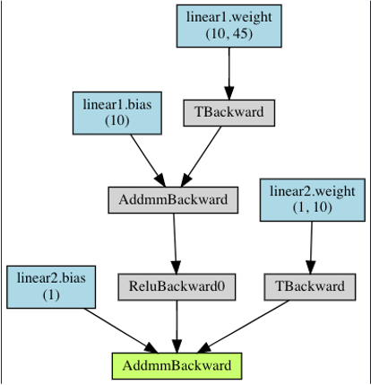

---
output:
  pdf_document:
    # citation_package: biblatex
    keep_tex: true
    fig_caption: true
    latex_engine: pdflatex
    template: ../svm-latex-ms.tex
title: "Predicting Opinion Change in Deliberative Groups (Natural Language Processing)"
thanks: "Code and data available at: github.com/rossdahlke/cs_230_project"
author:
- name: Ross Dahlke (rdahlke@stanford.edu)
affiliation: Stanford University
abstract: ""
date: "`r format(Sys.time(), '%B %d, %Y')`"
geometry: margin=1in
fontfamily: mathpazo
fontsize: 12pt
spacing: single
bibliography: ../milestone/bibliography.bib
biblio-style: apsr
header-includes: \usepackage{graphicx}
---

# 1. Introduction

Deliberative Democracy is when a representative sample of people come together for a short period of time to discuss civic issues. The idea is that through a deliberative process, where people have access to objective information and good conditions to discuss, people can come to conclusions on civic issues that are most representative of what people actually want [@fishkin]. In a time where so much discussion about political and civic issues happens in online information bubbles, Deliberative Democracy offers a chance for people to discuss issues on their merit and the freedom to change their opinions in order to reveal a better representation of public opinion. 

Deliberative Democracy Polling is a technique pioneered by Stanford University Professor Jim Fishkin and the Center for Deliberative Democracy (CDD). A Deliberative Poll is where individuals are asked about their opinions before and after a weekend of small-group deliberation. This method allows researchers to measure the change in people's opinions as a result of the deliberative sessions. 

For example, one session in Ghana was about water and agricultural policies in the country. Here is a excerpt of one of the participants expressing their opinion to the group when talking about farmers and their personal beliefs.

> What would really help our farmers is the marketing of their produce. That is what the farmers need. If they aren’t able to better market their produce, you would see that middlemen come and take advantage of them. At the end of the day, the farmers are frustrated and have to sell for less. This isn’t a good thing and needs to be addressed to support our farmers. The government needs to do this. In the past, we had food distribution companies, rice mills and others that used to buy from the farmers. That isn’t there anymore. This would make the farmers happy and encourage them to farm more. But if they always have to sell and run losses, it is very frustrating for them.


  
# 2. Related work

This project derives its inspiration from two main papers: "Attitude Change on Reddit's Change My View" [@cmv] and "A Deep-Learning Approach for Identifying Collective Action Events with Text and Image Data from Social Media" [@zhang]. The former paper found that the "the amount of evidence provided in a discussion predicts attitude change" on the Change My View Reddit forum. The latter paper was able to identify collective action events in China based on image and text data and provides inspiration on using text data to identify collective behavior that has real-world application and can be a component of future computational social science research. 

# 3. Dataset and Features

This project thanks the CDD for sharing their data. For this project, I have access to surveys and transcripts from three Deliberative Polls, each consisting of about 14 groups, with each group discussing in two or three different sessions. The surveys allow me to calculate opinion change on the issues discussed in each session before and after the deliberations. I use these pre- and post-surveys (responses on a 1-10 scale) to calculate an average delta in opinion change for each deliberative group for each topic session which I use as my dependent variable ^[See https://github.com/rossdahlke/cs_230_project/blob/master/preanalysis/preanalysis.pdf  for a pre-analysis of the distribution of survey data]. The transcripts are broken down by group by session, but they are not attributed to specific individuals. While the additional granularity of individually-attributed transcripts would have great and is something to consider devoting resources to in the future, these group-level opinion deltas and transcripts provide enough data to complete the task. In total, there are 101 examples.

# 4. Methods

To capture changes in the differences in the words that discussants use through their deliberations, I break each transcript down into 1/10th chunks. I then calculated the similarity of each 1/10th chunk to each other by comparing the word embeddings of each chunk. I used similarities from the spacy core model [@spacy2] and BERT [@bert]. For example, of a given transcript, there might be a similarity of .9 between the first and second 1/10th chunks and a similarity of .7 between the third and fourth 1/10th chunks. I use these similarities from each transcript to build two simple OLS models [@scikit-learn]. The first baseline model just uses the similarity of the second and tenth chunks (the first chunk is generally devoted to introductions, welcomes, etc.) to predict opinion deltas. The second model uses all of the similarities to try to predict opinion deltas. I also train a basic neural network in Pytorch [@pytorch] to try to predict the opinion deltas from all of the similarities. The BERT embeddings performed better than the spacy core model in the regressions, but not in the basic neural network.  

```{r include = T, echo = F, out.width = "50%", fig.align = "center", fig.cap = "Fig. 1: Architecture of basic neural network used on the similarities of word embeddings."}

```

In addition to this approach of using word embeddings, I also built a baseline model using Long Short-Term Memory in Pytorch on the sequences of words in the transcripts. 

Finally, I also used a BERT transformer, but this method performed poorly. 

All code examples that I used as starting points to build these models can be found commented in my code. 

# 5. Experiments/ Results/ Discussion

The main loss function that I used is mean squared error since I am trying to predict a specific value (as opposed to a discrete prediction of whether a group of people changed their opinions at all). Below is a table of the MSEs of the four methods mentioned in section 4. 

```{r, echo = F}
knitr::kable(tibble::tibble(method = c("One word embedding (spacy)", "All word embeddings (spacy)", "Basic NN (spacy)", "One word embedding (BERT)", "All word embeddings (BERT)", "Basic NN (BERT)",  "LSTM", "BERT transformer"),
       MSE = c(.149, .289, .064, .141, .201, .152, .130, .227)))
```

Using the word embedding similarity of the 2nd and 10th 1/10th chunks has a lower loss than using all of the similarities of the embeddings. But both of these perform worse than a basic neural network. 

Despite the varying levels of loss, all of the models seem to be performing poorly upon closer inspection. If you actually examine the predicted values, you see that they are all basically the same. Particularly the basic NN, which has the lowest loss, and the LSTM are simply finding the best average value and applying that "prediction" to all test examples. When I tried to build a more complex neural network, the problem was only exacerbated. To try to circumvent this problem, I am going to try to incorporate data from the Priniski paper. 

\newpage

# 6. Discussion and Next Steps

While the initial goal of training a deep learning model to be able to identify opinion change was largely unsucessful, there are some key learnings that I have from this project.

First, I clearly see now that the words that people are using are not predictive of opinion change. This finding is likely because people talk about the same things, but they talk about them differently. I came into this project theorizing that it is not _what_ people talk about that predicts opinion change, it is _how_ they talk about it. As such, my next steps for this project will be to undertake feature engineering to extract linguistic features, such as polarity, subjectivity, incivility, and citation of data.

And so, my next steps would be using previously coded examples of polarizty/ sentiment, incivility, etc. and transformers to build the features necessary that can be used in a machine or deep learning model to predict opinion change. 

\newpage

# References
